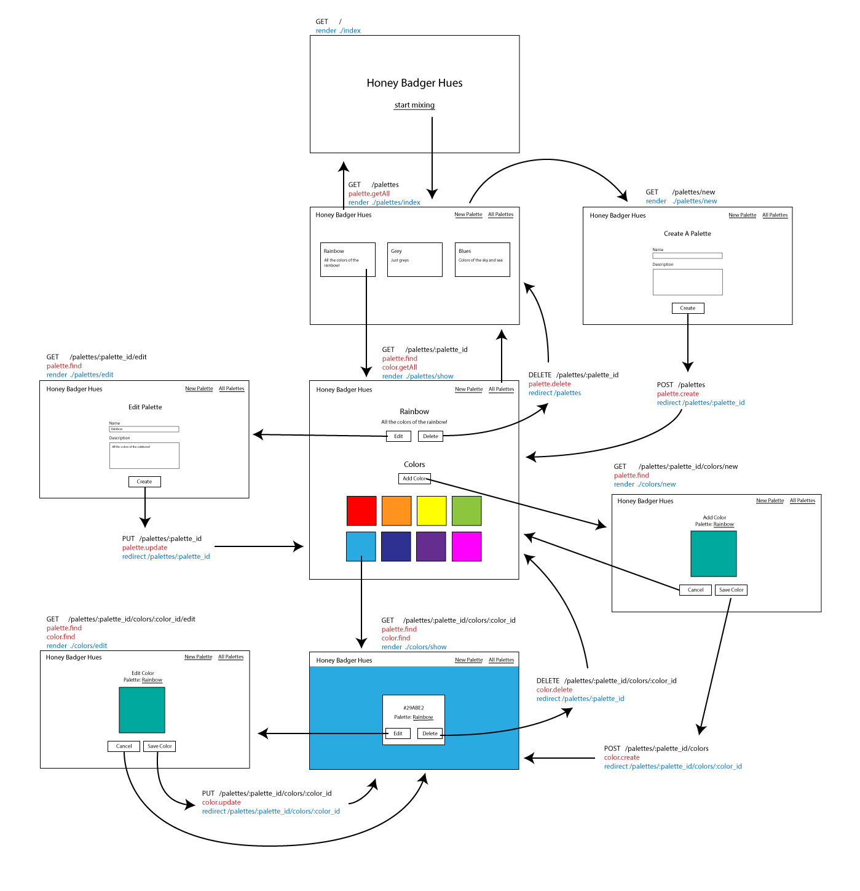

# HW W05D04 Honey Badger Colors

Today we are going to be **thinking** about our applications and their structure. To do so, we are going to scaffold an application where a user can make color palettes. We are going to create markdown files for each of our app's files and outline what each file does. 

## Application Flow / Mockups
Here is the spec of the application. Take a close look at it and what each of the pages show. Each of the requests are marked with the route in black, the model middleware in red and the controller middleware in blue.


## ASSIGNMENT
Go through every page and take detailed notes about what should be in each file. There are some examples in:
- [Palettes Controller](./controllers/palettesController.js.md)
- [Colors Model](./models/palette.js.md)
- Each of the palette views: [index](./views/palettes/index.html.md), [show](./views/palettes/show.html.md), [new](./views/palettes/new.html.md), [edit](./views/palettes/edit.html.md)

Take careful note on how we relate the `palettes` to the `colors`.

# Make sure to go through every page!

## Submission
Submit the homework by midnight tonight.

---
Below this line is other useful information about express applications. Feel free to add any general info you want.

## File Tree
```
.
├── controllers
│   ├── colorsController.js
│   └── palettesController.js
├── db
│   ├── config.js
│   └── seeds.sql
├── index.js
├── models
│   ├── color.js
│   └── palette.js
├── node_modules
├── package-lock.json
├── package.json
├── public
│   └── styles
│       └── style.css
└── views
    ├── colors
    │   ├── edit.html
    │   ├── new.html
    │   └── show.html
    ├── index.html
    └── palettes
        ├── edit.html
        ├── index.html
        ├── new.html
        └── show.html
```

## Set up

Steps we need to set up our application:

- Initiate npm in our application directory
```
npm init
```
- Install the packages we need for our application:
  - express (the base of our server, to set up routes)
  - mustache-express (to render views with data from our server)
  - body-parser (so we can get data from forms)
  - pg-promise (to make queries to our database)
  - method-override (so we can use PUT and DELETE requests)
  - morgan (to log our requests)
```
npm install --save express mustache-express body-parser pg-promise method-override morgan
```
